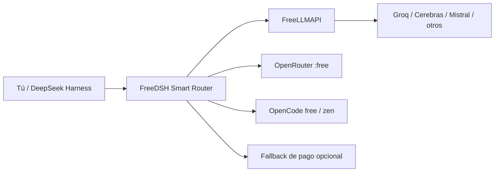

# 🐋 FreeDSH

### Usa DeepSeek Harness con modelos de IA gratuitos y económicos — con enrutamiento automático, respaldo y actualizaciones seguras.

**FreeDSH** es el nombre público de este repositorio (`dsh-h-v1`). Añade una capa práctica de distribución sobre [DeepSeek Harness](https://github.com/deepseek-ai/deepseek-harness): enrutamiento entre modelos gratuitos, puerta de enlace local de proveedores, una interfaz más cómoda, compatibilidad con pt-BR, configuración versionada y actualizaciones con reversión segura.

> **Proyecto no oficial.** FreeDSH no está afiliado a DeepSeek ni cuenta con su respaldo.

[](#instalar-en-1-minuto)
[](#instalar-en-1-minuto)
[](CONTRIBUTING.md)
[](LICENSE)
[](https://github.com/marcosmmjr2023/dsh-h-v1/releases)
[](https://github.com/marcosmmjr2023/dsh-h-v1/discussions)

**English:** [README.md](README.md) · **Português:** [README.pt-BR.md](README.pt-BR.md)


---

## Por qué FreeDSH

DeepSeek Harness es potente, pero en el día a día puede salir caro o volverse frágil si todo depende de un solo modelo o proveedor. FreeDSH propone otra forma de trabajar:

| | Lo que aporta FreeDSH |
|---|---|
| 🎁 **Enrutamiento con prioridad gratuita** | Usa FreeLLMAPI, OpenRouter `:free`, OpenCode free/zen y los demás proveedores que configures antes de pasar a una opción de pago. |
| 🔁 **Respaldo automático** | Si un proveedor falla o deja de estar disponible, el enrutador puede pasar a otra opción ya configurada. |
| 🧠 **Enrutamiento según la tarea** | Los perfiles `auto`, `eco` y `ultra` permiten usar modelos de distinta capacidad según el trabajo. |
| 🖥️ **Panel integrado** | Estado del proveedor, del enrutador y del núcleo, archivos recientes y controles de modelo dentro de la interfaz de Harness. |
| 🛡️ **Actualizaciones del núcleo más seguras** | Prueba un núcleo nuevo en una instancia paralela en lugar de sobrescribir el entorno que ya funciona. |
| ↩️ **Reversión** | Las instantáneas locales más el historial y las etiquetas de git permiten volver a una configuración que funcionaba. |
| 🌎 **Interfaz internacional** | Portugués brasileño, inglés y chino, siguiendo el idioma del sistema cuando es posible. |
| 💻 **Windows + Linux** | Instaladores interactivos de una sola línea para ambas plataformas. |

### La idea en un diagrama



Los planes gratuitos cambian con el tiempo. FreeDSH **no** elude las condiciones de los proveedores ni inventa acceso gratuito donde no lo hay; integra y dirige los proveedores y claves que tú configures.

---

## Instalar en 1 minuto

### Windows

Abre PowerShell y ejecuta:

```powershell
powershell -ExecutionPolicy Bypass -Command "$f=\"$env:TEMP\dsh-setup.ps1\"; irm https://raw.githubusercontent.com/marcosmmjr2023/dsh-h-v1/main/installer/dsh-setup.ps1 -Headers @{'Cache-Control'='no-cache'} -OutFile $f; & $f"
```

El instalador interactivo detecta si ya existe una instalación y puede instalar, actualizar, conservar la configuración local, gestionar instancias paralelas o abrir la interfaz gráfica.

Tras la instalación, abre una **nueva** ventana de PowerShell:

```powershell
dsh up          # abre la GUI
dsh update      # actualiza repo/core/overlay
dsh doctor      # diagnóstico
dsh env list    # lista las instancias paralelas
```

### Linux

En sistemas tipo Debian/Ubuntu:

```bash
bash <(curl -fsSL https://raw.githubusercontent.com/marcosmmjr2023/dsh-h-v1/main/installer/dsh-setup.sh)
```

Para una instalación manual o en servidor, consulta [docs/SERVER-MAP.md](docs/SERVER-MAP.md).

> Las credenciales de los proveedores se quedan en tu equipo y nunca deben subirse al repositorio. Lee [SECURITY.md](SECURITY.md) antes de exponer cualquier interfaz de FreeLLMAPI o de administración fuera de localhost.

### ¿Ya usas DeepSeek Harness?

FreeDSH también se distribuye como **paquete DSH**, pensado para quien ya tiene un harness funcionando y solo quiere los complementos (Smart Router, grupos de OpenRouter, visibilidad de modelos, acceso directo a FreeLLMAPI, panel lateral e insignia de versión). Sin instalador y sin copiar el overlay:

```bash
dsh plugin --profile web add github:marcosmmjr2023/dsh-h-v1
```

Para quitarlo: `dsh plugin --profile web remove freedsh`. El paquete solo registra complementos — no toca tus claves, proveedores ni ajustes. Requisitos, contenido incluido, dónde se guarda el estado y problemas frecuentes: **[docs/INSTALL-BUNDLE.md](docs/INSTALL-BUNDLE.md)**.

---

## Qué incluye

- **Smart Model Router** — selección de modelos con prioridad gratuita según la tarea y respaldo en tiempo de ejecución.
- **Integración con FreeLLMAPI** — puerta de enlace local para varios proveedores gratuitos o económicos.
- **Capa de interfaz** — insignias de estado, accesos directos y controles de modelo dentro de DeepSeek Harness.
- **Actualizador seguro del núcleo** — instancias paralelas estilo A/B con progreso en directo.
- **Overlay versionado** — ajustes, complementos y preajustes gestionados como código.
- **Herramientas de sincronización y reversión** — instantáneas locales, etiquetas e historial de git y utilidades de restauración.
- **Localización pt-BR** — traducción experimental de DeepSeek Harness y documentación traducida.

Panorama técnico: [docs/ARCHITECTURE.md](docs/ARCHITECTURE.md)

---

## Documentación

| Tema | Guía |
|---|---|
| Windows | [docs/WINDOWS.md](docs/WINDOWS.md) · [Português](docs/WINDOWS-PT.md) |
| Instalar como paquete DSH (`dsh plugin add`) | [docs/INSTALL-BUNDLE.md](docs/INSTALL-BUNDLE.md) |
| Linux / servidor | [docs/SERVER-MAP.md](docs/SERVER-MAP.md) |
| Actualización del núcleo / instancias paralelas | [docs/CORE-UPDATE.md](docs/CORE-UPDATE.md) |
| Sincronización / reversión | [docs/SYNC.en.md](docs/SYNC.en.md) · [Português](docs/SYNC.md) |
| Arquitectura | [docs/ARCHITECTURE.md](docs/ARCHITECTURE.md) |
| Hoja de ruta | [ROADMAP.md](ROADMAP.md) |
| Cambios | [CHANGELOG.md](CHANGELOG.md) |

> La documentación detallada sigue disponible en inglés (y en parte en portugués). Esta guía en español cubre la puesta en marcha; para el resto, enlaza con los manuales existentes en lugar de duplicarlos.

---

## Ayuda a construir FreeDSH

No hace falta dominar todo el proyecto. Algunas aportaciones útiles:

- probar un proveedor gratuito e informar de la compatibilidad;
- añadir o mejorar un adaptador de proveedor;
- mejorar la instalación en Windows o Linux;
- añadir traducciones;
- reproducir errores;
- mejorar la documentación;
- proponer mejores reglas de enrutamiento o comparativas.

Empieza por [CONTRIBUTING.md](CONTRIBUTING.md) y busca los temas etiquetados como **`good first issue`** o **`help wanted`**.

Las preguntas, ideas y dudas del tipo «¿funciona con X?» van a [Discussions](https://github.com/marcosmmjr2023/dsh-h-v1/discussions). Los errores y propuestas concretas van a [Issues](https://github.com/marcosmmjr2023/dsh-h-v1/issues): con un informe mínimo (sistema operativo, versión de PowerShell y salida de `dsh doctor`) se corrigen mucho más rápido.

Si usas FreeDSH y te resulta útil, una ⭐ en el repositorio ayuda a que otras personas usuarias de DeepSeek Harness lo descubran.

---

## Principios del proyecto

1. **Prioridad a lo gratuito, sin trampas.** Respeta las condiciones de los proveedores y usa el respaldo de pago cuando sea la opción fiable.
2. **Nunca rompas en silencio un entorno que funciona.** Guarda una instantánea antes de sustituir nada y haz que la reversión sea sencilla.
3. **Las credenciales se quedan en local.** Secretos, sesiones y estado de ejecución no pertenecen a git.
4. **Lo primero, el proyecto original.** FreeDSH amplía DeepSeek Harness; no pretende ser el proyecto original.
5. **La comunidad antes que la personalización privada.** Las mejoras reutilizables deberían convertirse en aportaciones documentadas y revisables.

---

## Licencia y atribución

- Overlay, herramientas, instalador y documentación originales de FreeDSH: **MIT** — ver [LICENSE](LICENSE).
- Qué cubre esa licencia MIT (y qué queda explícitamente fuera): [LICENSE-SCOPE.md](LICENSE-SCOPE.md).
- Recursos de terceros: ver [THIRD_PARTY_NOTICES.md](THIRD_PARTY_NOTICES.md).
- DeepSeek Harness se instala por separado y no se redistribuye como núcleo de este proyecto.

Avisos de seguridad: [SECURITY.md](SECURITY.md) · Normas de la comunidad: [CODE_OF_CONDUCT.md](CODE_OF_CONDUCT.md)
