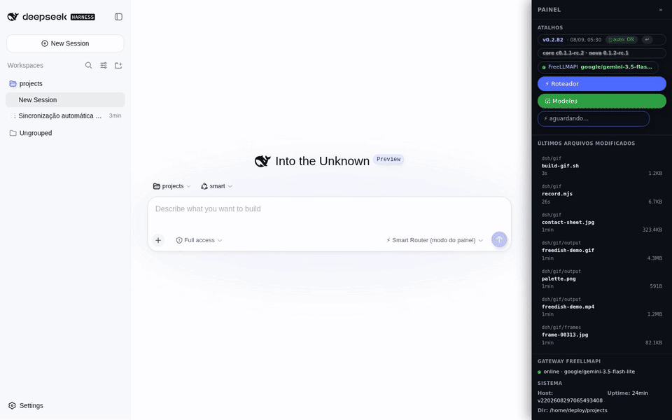
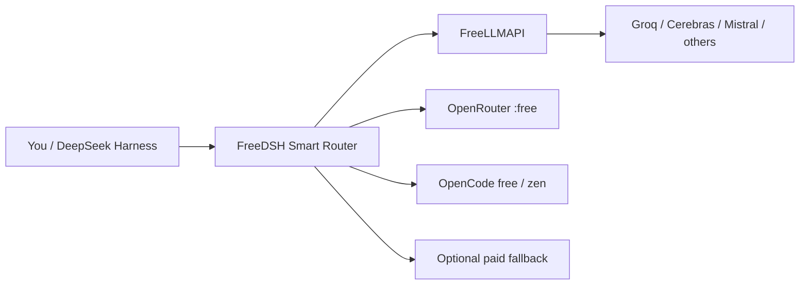

# 🐋 FreeDSH

### Run DeepSeek Harness with free and low-cost AI models — with automatic routing, fallback and safe updates.

**FreeDSH** is the community-facing name for this repository (`dsh-h-v1`). It adds a practical distribution layer on top of [DeepSeek Harness](https://github.com/deepseek-ai/deepseek-harness): free-model routing, a local provider gateway, a friendlier UI, pt-BR support, versioned configuration and rollback-safe updates.

> **Unofficial project.** FreeDSH is not affiliated with or endorsed by DeepSeek.

[](#install-in-1-minute)
[](#install-in-1-minute)
[](CONTRIBUTING.md)
[](LICENSE)

**Português:** [README.pt-BR.md](README.pt-BR.md)



---

## Why FreeDSH?

DeepSeek Harness is powerful, but a daily setup can become expensive or fragile when you depend on a single model/provider. FreeDSH focuses on a different experience:

| | FreeDSH adds |
|---|---|
| 🎁 **Free-first routing** | Use FreeLLMAPI, OpenRouter `:free`, OpenCode free/zen and other configured providers before paid fallback. |
| 🔁 **Automatic fallback** | If a provider fails or becomes unavailable, the router can move to another configured option. |
| 🧠 **Task-aware routing** | `auto`, `eco` and `ultra` profiles let the router choose different model tiers for different workloads. |
| 🖥️ **Integrated panel** | Provider/router/core status, recent files and model controls in the Harness UI. |
| 🛡️ **Safer core updates** | Test a new core in a parallel instance instead of overwriting the working environment. |
| ↩️ **Rollback** | Local snapshots + git history/tags make it possible to return to a known-good configuration. |
| 🌎 **International UI** | Brazilian Portuguese, English and Chinese support, following the OS language where available. |
| 💻 **Windows + Linux** | Interactive one-line installers for both platforms. |

### The idea in one diagram



Free tiers change over time. FreeDSH does **not** bypass provider terms or create free access where none exists; it integrates and routes the providers/keys you configure.

---

## Install in 1 minute

### Windows

Open PowerShell and run:

```powershell
irm https://raw.githubusercontent.com/marcosmmjr2023/dsh-h-v1/main/installer/dsh-setup.ps1 | iex
```

The interactive installer detects an existing installation and can install, update, preserve local configuration, manage parallel instances or open the GUI.

After installation, open a **new** PowerShell:

```powershell
dsh up          # open the GUI
dsh update      # update repo/core/overlay
dsh doctor      # diagnostics
dsh env list    # list parallel instances
```

### Linux

Debian/Ubuntu-like systems:

```bash
bash <(curl -fsSL https://raw.githubusercontent.com/marcosmmjr2023/dsh-h-v1/main/installer/dsh-setup.sh)
```

For manual/server installation, see [docs/SERVER-MAP.md](docs/SERVER-MAP.md).

> Provider credentials stay local and must never be committed. See [SECURITY.md](SECURITY.md) before exposing any FreeLLMAPI/admin interface beyond localhost.

---

## What is inside?

- **Smart Model Router** — free-first, task-aware model selection and runtime fallback.
- **FreeLLMAPI integration** — a local gateway for multiple free/low-cost providers.
- **UI overlay** — status badges, shortcuts and model controls inside DeepSeek Harness.
- **Safe core updater** — parallel A/B-style core instances with live progress.
- **Versioned overlay** — settings, plugins and presets managed as code.
- **Sync + rollback tools** — local snapshots, git tags/history and restore tooling.
- **pt-BR localization** — experimental DeepSeek Harness localization and translated docs.

Technical overview: [docs/ARCHITECTURE.md](docs/ARCHITECTURE.md)

---

## Documentation

| Topic | Guide |
|---|---|
| Windows | [docs/WINDOWS.md](docs/WINDOWS.md) · [Português](docs/WINDOWS-PT.md) |
| Linux / server | [docs/SERVER-MAP.md](docs/SERVER-MAP.md) |
| Core updates / parallel instances | [docs/CORE-UPDATE.md](docs/CORE-UPDATE.md) |
| Two-way sync / rollback | [docs/SYNC.en.md](docs/SYNC.en.md) · [Português](docs/SYNC.md) |
| Architecture | [docs/ARCHITECTURE.md](docs/ARCHITECTURE.md) |
| Roadmap | [ROADMAP.md](ROADMAP.md) |
| Changelog | [CHANGELOG.md](CHANGELOG.md) |

---

## Help build FreeDSH

You do **not** need to be an expert in the whole project. Useful contributions include:

- test a free provider and report compatibility;
- add or improve a provider adapter;
- improve Windows/Linux installation;
- add translations;
- reproduce bugs;
- improve documentation;
- propose better routing rules or benchmarks.

Start with [CONTRIBUTING.md](CONTRIBUTING.md), then look for issues tagged **`good first issue`** or **`help wanted`**.

If you use FreeDSH and it helps you, a ⭐ on the repository helps other DeepSeek Harness users discover it.

---

## Project principles

1. **Free-first, not free-at-any-cost.** Respect provider terms and use paid fallback when that is the reliable choice.
2. **Never break a working environment silently.** Snapshot before replacement and make rollback practical.
3. **Credentials stay local.** Secrets, sessions and runtime state do not belong in git.
4. **Upstream first.** FreeDSH extends DeepSeek Harness; it does not pretend to be the upstream project.
5. **Community over private customization.** Reusable improvements should become documented, reviewable contributions.

---

## License and attribution

- Original FreeDSH overlay/tools/installer/docs: **MIT** — see [LICENSE](LICENSE).
- Third-party assets: see [THIRD_PARTY_NOTICES.md](THIRD_PARTY_NOTICES.md).
- DeepSeek Harness is installed separately and is not redistributed as this project's core.

Security reports: [SECURITY.md](SECURITY.md) · Community standards: [CODE_OF_CONDUCT.md](CODE_OF_CONDUCT.md)
