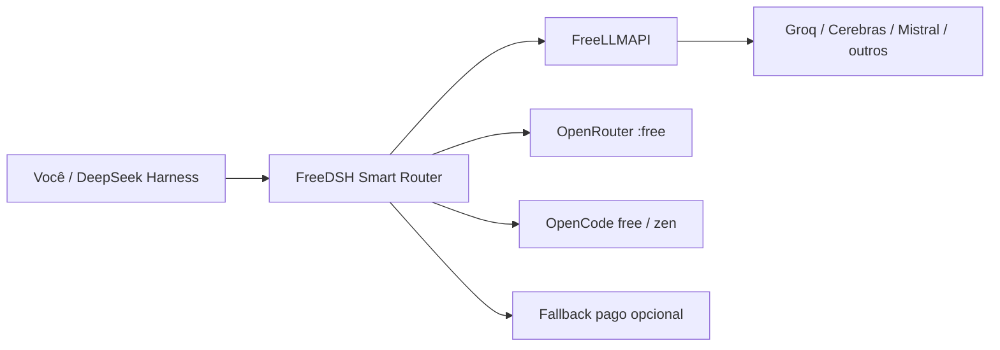

# 🐋 FreeDSH

### Rode o DeepSeek Harness com modelos gratuitos e de baixo custo — com roteamento automático, fallback e atualizações seguras.

**FreeDSH** é o nome público/comunitário deste repositório (`dsh-h-v1`). Ele adiciona uma camada prática sobre o [DeepSeek Harness](https://github.com/deepseek-ai/deepseek-harness): roteamento entre modelos gratuitos, gateway local de provedores, interface mais amigável, suporte pt-BR, configuração versionada e atualizações com rollback seguro.

> **Projeto não oficial.** FreeDSH não é afiliado nem endossado pela DeepSeek.

[](#instale-em-1-minuto)
[](#instale-em-1-minuto)
[](CONTRIBUTING.md)
[](LICENSE)

**English:** [README.md](README.md)


---

## Por que FreeDSH?

O DeepSeek Harness é poderoso, mas o uso diário pode ficar caro ou frágil quando depende de um único modelo/provedor. O FreeDSH tenta oferecer outra experiência:

| | O que o FreeDSH adiciona |
|---|---|
| 🎁 **Roteamento free-first** | Usa FreeLLMAPI, OpenRouter `:free`, OpenCode free/zen e outros provedores configurados antes do fallback pago. |
| 🔁 **Fallback automático** | Se um provedor falhar ou ficar indisponível, o roteador pode migrar para outra opção configurada. |
| 🧠 **Roteamento por tarefa** | Perfis `auto`, `eco` e `ultra` permitem usar níveis diferentes de modelo conforme o trabalho. |
| 🖥️ **Painel integrado** | Status de provedor/roteador/core, arquivos recentes e controles de modelo dentro da interface do Harness. |
| 🛡️ **Atualização mais segura do core** | Teste um core novo em instância paralela sem sobrescrever o ambiente que já funciona. |
| ↩️ **Rollback** | Snapshots locais + histórico/tags do git permitem voltar para uma configuração conhecida. |
| 🌎 **Interface internacional** | Português brasileiro, inglês e chinês, seguindo o idioma do sistema quando disponível. |
| 💻 **Windows + Linux** | Instaladores interativos em uma linha nos dois sistemas. |

### A ideia em um diagrama



Os tiers gratuitos mudam com o tempo. O FreeDSH **não** burla termos de provedores nem cria acesso gratuito onde ele não existe; ele integra e roteia os provedores/chaves que você configurar.

---

## Instale em 1 minuto

### Windows

Abra o PowerShell e execute:

```powershell
powershell -ExecutionPolicy Bypass -Command "irm https://raw.githubusercontent.com/marcosmmjr2023/dsh-h-v1/main/installer/dsh-setup.ps1 | iex"
```

O instalador interativo detecta instalações existentes e pode instalar, atualizar, preservar configurações locais, gerenciar instâncias paralelas ou abrir a GUI.

Depois da instalação, abra um **novo** PowerShell:

```powershell
dsh up          # abre a GUI
dsh update      # atualiza repo/core/overlay
dsh doctor      # diagnóstico
dsh env list    # lista instâncias paralelas
```

### Linux

Debian/Ubuntu e semelhantes:

```bash
bash <(curl -fsSL https://raw.githubusercontent.com/marcosmmjr2023/dsh-h-v1/main/installer/dsh-setup.sh)
```

Para instalação manual/servidor, consulte [docs/SERVER-MAP.md](docs/SERVER-MAP.md).

> Credenciais de provedores ficam locais e nunca devem ser commitadas. Leia [SECURITY.md](SECURITY.md) antes de expor qualquer interface do FreeLLMAPI/admin além do localhost.

---

## O que existe no projeto?

- **Smart Model Router** — seleção free-first por tipo de tarefa e fallback em runtime.
- **Integração FreeLLMAPI** — gateway local para múltiplos provedores gratuitos/de baixo custo.
- **Overlay de interface** — badges de status, atalhos e controles dentro do DeepSeek Harness.
- **Atualizador seguro do core** — instâncias paralelas estilo A/B com progresso ao vivo.
- **Overlay versionado** — settings, plugins e presets tratados como código.
- **Ferramentas de sync + rollback** — snapshots locais, tags/histórico git e restauração.
- **Localização pt-BR** — tradução experimental do DeepSeek Harness e documentação em português.

Visão técnica: [docs/ARCHITECTURE.md](docs/ARCHITECTURE.md)

---

## Documentação

| Tema | Guia |
|---|---|
| Windows | [docs/WINDOWS-PT.md](docs/WINDOWS-PT.md) · [English](docs/WINDOWS.md) |
| Linux / servidor | [docs/SERVER-MAP.md](docs/SERVER-MAP.md) |
| Atualização do core / instâncias paralelas | [docs/CORE-UPDATE.md](docs/CORE-UPDATE.md) |
| Sincronização / rollback | [docs/SYNC.md](docs/SYNC.md) · [English](docs/SYNC.en.md) |
| Arquitetura | [docs/ARCHITECTURE.md](docs/ARCHITECTURE.md) |
| Roadmap | [ROADMAP.md](ROADMAP.md) |
| Histórico | [CHANGELOG.md](CHANGELOG.md) |

---

## Ajude a construir o FreeDSH

Você **não** precisa dominar o projeto inteiro. Contribuições úteis incluem:

- testar um provedor gratuito e relatar compatibilidade;
- adicionar ou melhorar um adapter de provedor;
- melhorar instalação Windows/Linux;
- adicionar traduções;
- reproduzir bugs;
- melhorar documentação;
- propor regras melhores de roteamento ou benchmarks.

Comece em [CONTRIBUTING.md](CONTRIBUTING.md) e procure issues marcadas como **`good first issue`** ou **`help wanted`**.

Se o FreeDSH for útil para você, uma ⭐ no repositório ajuda outros usuários do DeepSeek Harness a encontrá-lo.

---

## Princípios do projeto

1. **Free-first, não grátis a qualquer custo.** Respeitar os termos dos provedores e usar fallback pago quando for a opção confiável.
2. **Nunca quebrar silenciosamente um ambiente que funciona.** Criar snapshot antes de substituir e tornar rollback simples.
3. **Credenciais ficam locais.** Segredos, sessões e estado de runtime não pertencem ao git.
4. **Upstream primeiro.** O FreeDSH estende o DeepSeek Harness; não se apresenta como o projeto oficial.
5. **Comunidade acima de customização privada.** Melhorias reutilizáveis devem virar contribuições documentadas e revisáveis.

---

## Licença e atribuição

- Overlay/tools/installer/docs originais do FreeDSH: **MIT** — veja [LICENSE](LICENSE).
- Assets de terceiros: veja [THIRD_PARTY_NOTICES.md](THIRD_PARTY_NOTICES.md).
- O DeepSeek Harness é instalado separadamente e não é redistribuído como core deste projeto.

Relatos de segurança: [SECURITY.md](SECURITY.md) · Regras da comunidade: [CODE_OF_CONDUCT.md](CODE_OF_CONDUCT.md)
